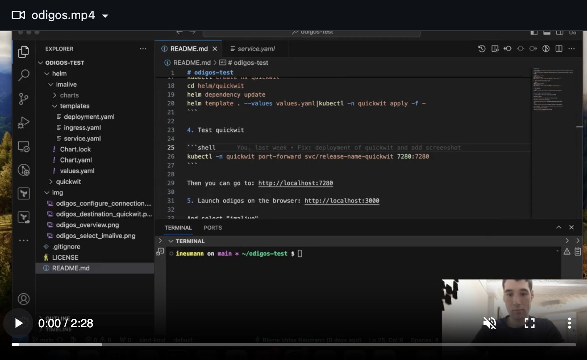
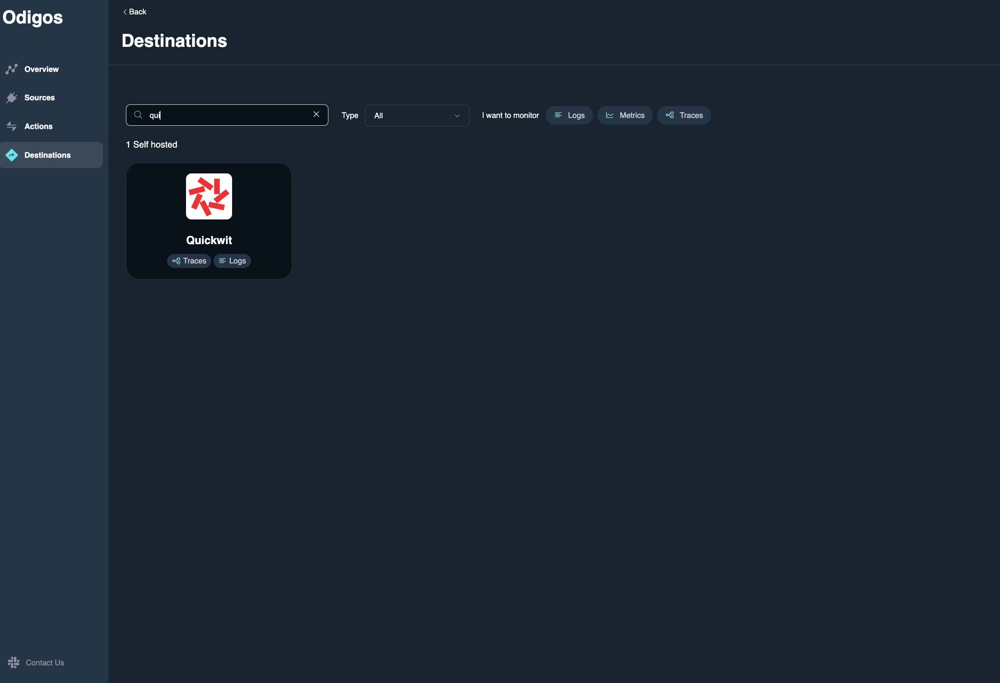
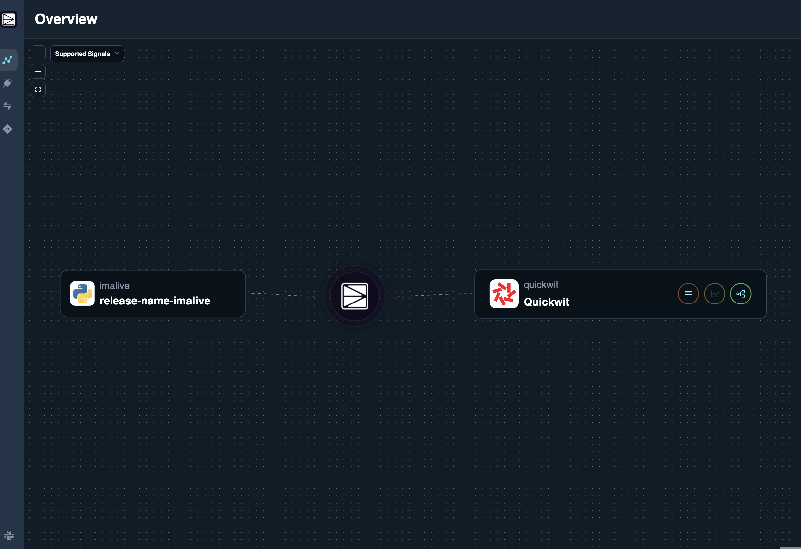
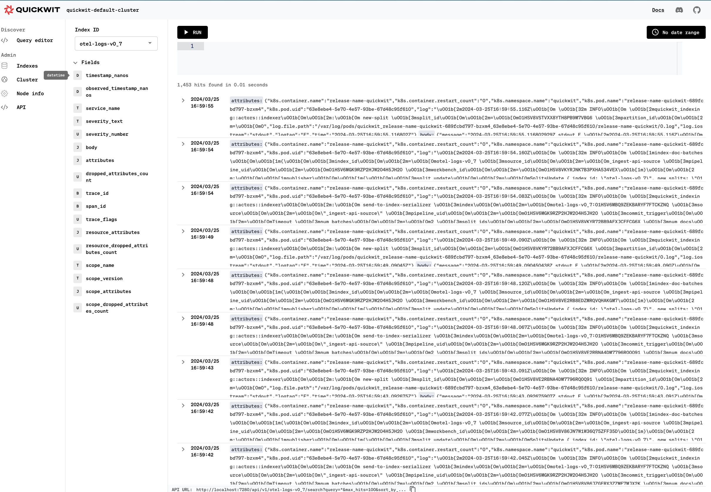

# odigos-quickwit-demo

## Introduction

Demo of the [quickwit destination of odigos](https://docs.odigos.io/backends/quickwit).

It has been made with this [pull request](https://github.com/keyval-dev/odigos/pull/907) and released in the v1.0.49.

## Demo

You can download the demo here

[](./medias/demo.mp4)

## Try the demo by yourself

1. Install and run odigos (version v1.0.49 at least) on a kind cluster:

```shell
brew install keyval-dev/homebrew-odigos-cli/odigos
odigos version
kind create cluster
odigos install
```

2. Run [imalive](https://github.com/comworkio/imalive) on the same kind cluster that is used by odigos

```shell
kubectl create ns imalive
cd helm/imalive
helm dependency update
helm template . --values values.yaml|kubectl -n imalive apply -f -
```

3. Run quickwit on the same kind cluster

```shell
kubectl create ns quickwit
cd helm/quickwit
helm dependency update
helm template . --values values.yaml|kubectl -n quickwit apply -f -
```

4. Test quickwit

```shell
kubectl -n quickwit port-forward svc/release-name-quickwit 7280:7280
```

Then you can go to: http://localhost:7280

5. Launch odigos on the browser

```shell
odigos ui
```

Then you can go here: http://localhost:3000

And select "imalive"


Then select the "Quickwit" destination



Then:


URL of endpoint: `release-name-quickwit.quickwit.svc.cluster.local:7281`

Then you should see this overview:



Then you should see the logs coming into quickwit:


